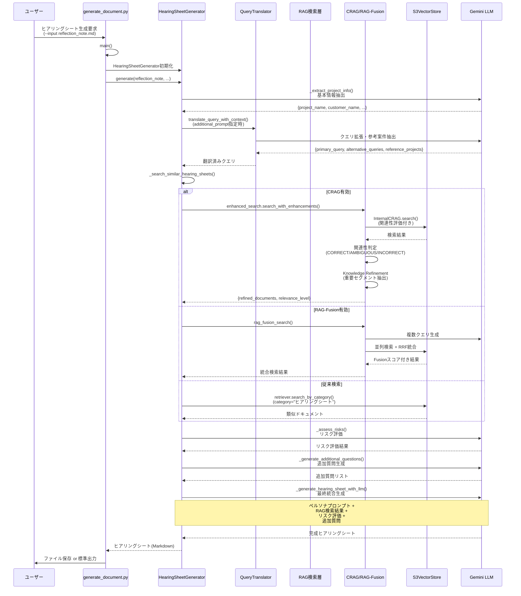

# LISAヒアリングシート生成のRAGフロー完全ガイド

**作成日**: 2025-10-31
**作成者**: Claude Code
**対象**: LISA PoC - ヒアリングシート生成機能

---

## 目次

1. [全体フロー図](#全体フロー図)
2. [詳細フロー（関数レベル）](#詳細フロー関数レベル)
3. [RAG検索の3つの戦略](#rag検索の3つの戦略)
4. [S3 Vectors検索詳細](#s3-vectors検索詳細)
5. [主要な関数一覧](#主要な関数一覧)
6. [アーキテクチャの特徴](#アーキテクチャの特徴)

---

## 全体フロー図



---

## 詳細フロー（関数レベル）

### フェーズ1: 初期化とエントリーポイント

#### 1.1 `generate_document.py::main()`

```python
# 役割: CLIエントリーポイント、環境設定、コンポーネント初期化

┌─────────────────────────────────────────────────┐
│ 1. コマンドライン引数パース                       │
│    - document_type: 'hearing-sheet' or 'proposal'│
│    - input: ソースドキュメントパス                 │
│    - enable_crag: CRAG有効化フラグ                │
│    - additional_prompt: Query Translation用       │
└─────────────────────────────────────────────────┘
         ↓
┌─────────────────────────────────────────────────┐
│ 2. RAGシステム初期化                            │
│    - GeminiEmbeddings(model="gemini-embedding-001")│
│    - S3VectorStore(bucket="lisa-poc-vectors")   │
└─────────────────────────────────────────────────┘
         ↓
┌─────────────────────────────────────────────────┐
│ 3. generate_hearing_sheet()呼び出し             │
│    → HearingSheetGeneratorへ委譲                │
└─────────────────────────────────────────────────┘
```

**使用例**:
```bash
# 基本的な使用
python generate_document.py hearing-sheet \
    --input reflection_note.md \
    --output hearing_sheet.md

# Query Translation + CRAG有効化
python generate_document.py hearing-sheet \
    --input reflection_note.md \
    --output hearing_sheet.md \
    --enable-crag \
    --additional-prompt "ヤーマン案件を参考に、期限が厳しいので精度重視で"
```

#### 1.2 `generate_document.py::generate_hearing_sheet()`

```python
# 役割: ヒアリングシート生成のオーケストレーター

┌─────────────────────────────────────────────────┐
│ 1. HearingSheetGenerator初期化                  │
│    - vector_store: S3VectorStore                │
│    - embeddings: GeminiEmbeddings               │
│    - enable_crag: CRAG有効化                    │
└─────────────────────────────────────────────────┘
         ↓
┌─────────────────────────────────────────────────┐
│ 2. プロジェクト情報のオーバーライド               │
│    - project_context = {                        │
│        "project_name": args.project_name,       │
│        "customer_name": args.customer_name      │
│      }                                          │
└─────────────────────────────────────────────────┘
         ↓
┌─────────────────────────────────────────────────┐
│ 3. generator.generate()呼び出し                 │
│    - reflection_note: 入力ノート                │
│    - project_context: 追加情報                  │
│    - search_k: RAG検索件数                      │
│    - additional_prompt: Query Translation用     │
└─────────────────────────────────────────────────┘
```

---

### フェーズ2: ヒアリングシート生成の5段階処理

#### 2.1 `HearingSheetGenerator::generate()`

**ファイル**: `generators/hearing_sheet_generator.py:593-660`

```python
# 役割: ヒアリングシート生成の5段階処理

┌─────────────────────────────────────────────────┐
│ [1/5] _extract_project_info()                  │
│  リフレクションノートから基本情報を抽出          │
│  → LLMにJSON抽出プロンプトを送信               │
│  → {project_name, customer_name, industry,     │
│      scale, target_date, background}           │
└─────────────────────────────────────────────────┘
         ↓
┌─────────────────────────────────────────────────┐
│ [2/5] _search_similar_hearing_sheets()         │
│  類似案件のヒアリングシートを検索（RAG）         │
│  ※ 次のセクションで詳細説明                     │
└─────────────────────────────────────────────────┘
         ↓
┌─────────────────────────────────────────────────┐
│ [3/5] _assess_risks()                          │
│  プロジェクトリスクを評価                       │
│  → LLMにリスク評価プロンプトを送信             │
│  → 体制規模、契約形態、技術的実現性などを判定   │
└─────────────────────────────────────────────────┘
         ↓
┌─────────────────────────────────────────────────┐
│ [4/5] _generate_additional_questions()         │
│  追加確認事項を生成                            │
│  → 類似案件のヒントを参照                      │
│  → LLMで重要度順の質問項目を生成               │
└─────────────────────────────────────────────────┘
         ↓
┌─────────────────────────────────────────────────┐
│ [5/5] _generate_hearing_sheet_with_llm()       │
│  最終的なヒアリングシートを生成                │
│  → ペルソナプロンプト読み込み                  │
│  → RAG結果 + リスク評価 + 追加質問を統合       │
│  → LLMで完全なMarkdownドキュメント生成         │
└─────────────────────────────────────────────────┘
```

---

### フェーズ3: RAG検索実行（最重要）

#### 3.1 `HearingSheetGenerator::_search_similar_hearing_sheets()`

**ファイル**: `generators/hearing_sheet_generator.py:194-303`

```python
# 役割: Query Translation + CRAG/RAG-Fusion/従来検索の分岐

┌─────────────────────────────────────────────────┐
│ ステップ1: Query Translation（オプション）       │
│ ※ additional_prompt指定時のみ                  │
└─────────────────────────────────────────────────┘
```
- 検索手法の選択は**3段階の優先順位**で判定
    - **優先順位**: CRAG > RAG-Fusion > 従来検索
    - **CRAG**: --enable-cragフラグまたはENABLE_CRAG環境変数
    - **RAG-Fusion**: USE_RAG_FUSION環境変数（デフォルト有効）+ project_name必須
    - **従来検索**: 上記が該当しない場合の自動フォールバック


**Query Translation実行時**:
```python
if additional_prompt:
    ┌─────────────────────────────────────────────┐
    │ query_translator::translate_query_with_context()│
    │  - ユーザーの追加指示を解析                  │
    │  - 参考プロジェクト名を抽出                  │
    │  - 検索クエリを最適化                        │
    │                                              │
    │  入力例: "ヤーマン案件を参考に、期限が厳しい" │
    │  出力: {                                     │
    │    "primary_query": "短納期・データ移行重視",│
    │    "alternative_queries": [                  │
    │      "短納期プロジェクト",                   │
    │      "データ移行案件"                        │
    │    ],                                        │
    │    "reference_projects": ["ヤーマン"]        │
    │  }                                           │
    └─────────────────────────────────────────────┘
         ↓
    base_query = translated["primary_query"]
    project_name = translated["reference_projects"][0]
```

---

## RAG検索の3つの戦略

### 戦略1: CRAG検索（Corrective RAG）

**トリガー条件**: `enable_crag=True`

**ファイル**:
- `rag/enhanced_rag_search.py:77-149`
- `rag/corrective_rag.py`

```python
if self.enable_crag and self.enhanced_search:
    ┌─────────────────────────────────────────────┐
    │ EnhancedRAGSearch::search_with_enhancements()│
    │                                              │
    │ STEP 1: InternalCRAG検索                    │
    │  - corrective_rag.py::InternalCRAG.search() │
    │  - ベクトル検索 + 関連性評価                │
    │                                              │
    │ STEP 2: 関連性レベル判定                    │
    │  evaluator.py::RelevanceEvaluator           │
    │  - CORRECT (スコア > 0.5): 高関連性         │
    │  - AMBIGUOUS (-0.5 ~ 0.5): 中間            │
    │  - INCORRECT (< -0.5): 低関連性            │
    │                                              │
    │ STEP 3: Knowledge Refinement                │
    │  corrective_rag.py::KnowledgeRefinement     │
    │  - ドキュメントを重要セグメントに分割       │
    │  - LLMで関連性の高いセグメントのみ選択      │
    │  - 精製済みドキュメントを生成               │
    │                                              │
    │ STEP 4: 関連性に応じた追加検索              │
    │  - INCORRECT → 類似プロジェクト重視         │
    │  - AMBIGUOUS → 通常の類似検索               │
    │  - CORRECT → 現プロジェクト優先             │
    └─────────────────────────────────────────────┘
         ↓
    results = {
        "current_project_results": [(doc1, dist1), ...],
        "similar_project_results": [(doc2, dist2), ...],
        "refined_documents": [refined_doc1, ...],
        "relevance_level": "correct",
        "confidence": 0.85,
        "strategy_used": "crag"
    }
```

**特徴**:
- ✅ 検索結果の関連性を自動評価
- ✅ 重要なセグメントのみを抽出（ノイズ除去）
- ✅ 関連性が低い場合は自動的に検索範囲を拡大
- ⚠️ LLM呼び出しが多い（コスト高）

---

### 戦略2: RAG-Fusion検索（改善版）

**トリガー条件**:
- `USE_RAG_FUSION=true` (環境変数)
- `project_name`が指定されている

**ファイル**:
- `rag/rag_fusion.py`
- `generators/hearing_sheet_generator.py:267-314`
- `generators/proposal_generator.py:259-306`

**重要な変更 (2025-10-31)**:
- ❌ **旧実装**: `project_name`フィルタのみで同一プロジェクト内のみを検索（類似案件にならない）
- ✅ **新実装**: 現在プロジェクト + 他プロジェクトの類似案件を併用

```python
elif os.getenv('USE_RAG_FUSION', 'true').lower() == 'true':
    ┌─────────────────────────────────────────────┐
    │ 改善版 RAG-Fusion検索フロー                 │
    │                                              │
    │ STEP 0: 準備                                │
    │  - orig_project = project_name (退避)       │
    │  - k分割: k_current / k_similar             │
    │    ratio = RAG_FUSION_CURRENT_RATIO (0.5)   │
    │    k_current = max(1, int(k * 0.5))         │
    │    k_similar = k - k_current                │
    │                                              │
    │ STEP 1: 現在プロジェクト検索                │
    │  rag_fusion_search()                        │
    │  - base_queryから3つの類似クエリを生成      │
    │  - 例: "ECサイト リニューアル"             │
    │    → ["ECサイト構築事例",                  │
    │        "リニューアル実績",                  │
    │        "モバイル対応EC開発"]                │
    │  - 並列検索 (project_name=$eq)              │
    │  - RRF (Reciprocal Rank Fusion) 統合        │
    │  - 上位k_current件を取得                    │
    │                                              │
    │ STEP 2: 他プロジェクト類似案件検索          │
    │  retriever.get_cross_project_insights()     │
    │  - base_queryで検索                         │
    │  - exclude_project=orig_project ($ne)       │
    │  - 上位k_similar件を取得                    │
    │                                              │
    │ STEP 3: マージと再スコアリング              │
    │  apply_hybrid_scoring()                     │
    │  - 現在 + 類似をマージ                      │
    │  - ハイブリッドスコアリング:                │
    │    * 類似度スコア                           │
    │    * 時系列重み (新しい文書優先)            │
    │    * メタデータスコア                       │
    │  - 上位k件を最終結果として返却              │
    └─────────────────────────────────────────────┘
         ↓
    results = [
        (doc_current_1, hybrid_score1),  # 現在プロジェクト
        (doc_similar_1, hybrid_score2),  # 類似プロジェクト
        (doc_current_2, hybrid_score3),
        ...
    ]
```

**特徴**:
- ✅ **修正済み**: 他プロジェクトの類似案件も取得（本来の「類似案件検索」）
- ✅ 複数の視点から検索（検索漏れ防止）
- ✅ RRFで検索結果を統合（ロバスト性向上）
- ✅ 時系列重み付け（新しい情報を優先）
- ✅ 現在/類似の比率を環境変数で調整可能 (`RAG_FUSION_CURRENT_RATIO`)
- ✅ CRAGと同様の「現在 + 類似」パターンに統一
- ⚠️ LLM呼び出し中程度（クエリ生成のみ）

---

### 戦略3: 従来検索（デフォルト）

**トリガー条件**: 上記2つが無効の場合

**ファイル**:
- `rag/rag_retriever.py`
- `rag/vector_store.py`

```python
else:
    ┌─────────────────────────────────────────────┐
    │ RAGRetriever::search_by_category()          │
    │                                              │
    │ STEP 1: クエリベクトル化                    │
    │  - embeddings.embed_text(query)             │
    │  - 1536次元ベクトルに変換                    │
    │                                              │
    │ STEP 2: カテゴリフィルタ設定                │
    │  - filter = {                               │
    │      "document_type": {                     │
    │        "$eq": "ヒアリングシート"            │
    │      }                                       │
    │    }                                         │
    │                                              │
    │ STEP 3: S3 Vectors検索                      │
    │  - vector_store.search_by_category()        │
    │  - S3 VectorsのAPIでフィルタ付き類似検索    │
    └─────────────────────────────────────────────┘
         ↓
    results = [
        (doc1, distance1),
        (doc2, distance2),
        ...
    ]
```

**特徴**:
- ✅ シンプルで高速
- ✅ LLM呼び出し最小（コスト低）
- ✅ S3 Vectorsのフィルタ機能を活用
- ⚠️ 単一クエリのみ（検索精度は基本的）

---

## S3 Vectors検索詳細

### S3VectorStore::search_by_category()

**ファイル**: `rag/vector_store.py:323-375`

```python
┌─────────────────────────────────────────────────┐
│ 役割: カテゴリフィルタ付きベクトル検索          │
└─────────────────────────────────────────────────┘
         ↓
┌─────────────────────────────────────────────────┐
│ ステップ1: フィルタ構築                         │
│  # 基本フィルタ                                 │
│  filter_dict = {                                │
│    "document_type": {"$eq": category}           │
│  }                                              │
│                                                 │
│  # 追加フィルタがある場合                       │
│  filter_dict = {                                │
│    "$and": [                                    │
│      {"document_type": {"$eq": "ヒアリングシート"}},│
│      {"project_name": {"$eq": "ヤーマン"}}      │
│    ]                                            │
│  }                                              │
└─────────────────────────────────────────────────┘
         ↓
┌─────────────────────────────────────────────────┐
│ ステップ2: similarity_search()呼び出し          │
└─────────────────────────────────────────────────┘
```

### S3VectorStore::similarity_search()

**ファイル**: `rag/vector_store.py:377-531`

```python
┌─────────────────────────────────────────────────┐
│ AWS S3 Vectors API呼び出し                      │
└─────────────────────────────────────────────────┘
         ↓
query_params = {
    "vectorBucketName": "lisa-poc-vectors",
    "indexName": "project-documents",
    "queryVector": {"float32": [0.1, 0.2, ...]},  # 1536次元
    "topK": 5,
    "returnDistance": True,
    "returnMetadata": True,
    "filter": {"document_type": {"$eq": "ヒアリングシート"}}
}

response = self.client.query_vectors(**query_params)
         ↓
┌─────────────────────────────────────────────────┐
│ レスポンス処理                                  │
│  - S3 VectorsからJSON形式でメタデータ復元      │
│  - 10個のメタデータグループを展開:             │
│    1. project_name (フィルタ用)                │
│    2. file_name (フィルタ用)                   │
│    3. document_type (フィルタ用)               │
│    4. basic_info (JSON)                        │
│    5. hierarchy_info (JSON)                    │
│    6. structure_info (JSON)                    │
│    7. position_info (JSON)                     │
│    8. analysis_info (JSON)                     │
│    9. list_data (JSON)                         │
│   10. source_text (40KB制限)                   │
└─────────────────────────────────────────────────┘
         ↓
results = [
    (Document(
        key="doc_abc123_0",
        text="ヒアリングシート本文...",
        metadata={
            "project_name": "ヤーマン",
            "document_type": "ヒアリングシート",
            "importance": "high",
            "has_table": True,
            "information_density": 0.75,
            ...
        }
    ), distance=0.15),
    ...
]
```

---

## 主要な関数一覧

### 実行順序

| # | 関数名 | ファイル | 役割 | LLM呼び出し |
|---|--------|---------|------|-------------|
| 1 | `main()` | generate_document.py:173 | CLIエントリーポイント | ❌ |
| 2 | `generate_hearing_sheet()` | generate_document.py:87 | オーケストレーター | ❌ |
| 3 | `HearingSheetGenerator.__init__()` | hearing_sheet_generator.py:40 | ジェネレーター初期化 | ❌ |
| 4 | `HearingSheetGenerator.generate()` | hearing_sheet_generator.py:593 | 生成メインフロー | ✅ |
| 5 | `_extract_project_info()` | hearing_sheet_generator.py:140 | プロジェクト情報抽出 | ✅ |
| 6 | `_search_similar_hearing_sheets()` | hearing_sheet_generator.py:194 | **RAG検索メイン** | 条件付き |
| 7 | `translate_query_with_context()` | query_translator.py | Query Translation | ✅ |
| 8 | `EnhancedRAGSearch.search_with_enhancements()` | enhanced_rag_search.py:77 | CRAG統合検索 | ✅ |
| 9 | `InternalCRAG.search()` | corrective_rag.py | CRAG検索 | ✅ |
| 10 | `RelevanceEvaluator.evaluate_batch()` | evaluator.py | 関連性判定 | ✅ |
| 11 | `KnowledgeRefinement.refine_documents()` | corrective_rag.py | 重要セグメント抽出 | ✅ |
| 12 | `rag_fusion_search()` | rag_fusion.py | RAG-Fusion検索 | ✅ |
| 13 | `RAGRetriever.search_by_category()` | rag_retriever.py | 従来型カテゴリ検索 | ❌ |
| 14 | `S3VectorStore.search_by_category()` | vector_store.py:323 | S3 Vectorsフィルタ検索 | ❌ |
| 15 | `S3VectorStore.similarity_search()` | vector_store.py:377 | **S3 Vectors API呼び出し** | ❌ |
| 16 | `_assess_risks()` | hearing_sheet_generator.py:353 | リスク評価 | ✅ |
| 17 | `_generate_additional_questions()` | hearing_sheet_generator.py:394 | 追加質問生成 | ✅ |
| 18 | `_generate_hearing_sheet_with_llm()` | hearing_sheet_generator.py:440 | **最終ドキュメント生成** | ✅ |
| 19 | `save_document()` | generate_document.py:68 | ファイル保存 | ❌ |

### LLM呼び出し回数の比較

| 戦略 | LLM呼び出し回数 | 主な用途 |
|------|----------------|---------|
| **CRAG** | **多**（7-10回） | 関連性評価 + Knowledge Refinement + 基本生成 |
| **RAG-Fusion** | **中**（4-6回） | クエリ生成 + 基本生成 |
| **従来検索** | **少**（3回） | 基本生成のみ |

---

## アーキテクチャの特徴

### 1. 段階的な検索精度向上

```
従来検索 (Baseline)
    ↓
RAG-Fusion (複数クエリ統合)
    ↓
CRAG (関連性評価 + Knowledge Refinement)
```

各段階でLLM呼び出しが増えるが、検索精度とドキュメント品質が向上。

---

### 2. Query Translation による文脈理解

**入力**:
```
リフレクションノート: "新規ECサイト構築、短納期"
追加プロンプト: "ヤーマン案件を参考に、データ移行に注意"
```

**Query Translationの出力**:
```json
{
  "primary_query": "ECサイト構築・短納期・データ移行重視案件",
  "alternative_queries": [
    "短納期ECサイト開発",
    "大規模データ移行プロジェクト"
  ],
  "reference_projects": ["ヤーマン"],
  "key_concerns": ["短納期リスク", "データ移行品質"]
}
```

これにより、**ユーザーの意図を正確に理解した検索**が可能になる。

---

### 3. メタデータの10キーグループ化

S3 Vectorsの10キー制限を回避するため、関連するメタデータをJSON形式でグループ化：

```python
metadata = {
    # フィルタ用独立フィールド（3個）
    "project_name": "ヤーマン",
    "file_name": "hearing_sheet_20240115.md",
    "document_type": "ヒアリングシート",

    # JSONグループ（7個）
    "basic_info": json.dumps({
        "title": "データ移行要件",
        "chunk_index": 5,
        "created_at": "2024-01-15",
        ...
    }),
    "hierarchy_info": json.dumps({...}),
    "structure_info": json.dumps({...}),
    "position_info": json.dumps({...}),
    "analysis_info": json.dumps({...}),
    "list_data": json.dumps({...}),
    "source_text": "ヒアリングシート本文..."
}
```

これにより、**豊富なメタデータを保持しながらS3 Vectorsの制約に対応**。

---

### 4. ペルソナプロンプトによる生成品質向上

最終生成時にペルソナプロンプトを読み込み：

```python
specialist_persona = self._load_specialist_persona()
# outputs/specialist_persona_prompt_latest.md から読み込み

generation_prompt = f"""
## あなたの役割
{specialist_persona}

## タスク
以下の情報を元に、顧客とのヒアリングに使用するヒアリングシートを作成してください。

# 入力情報

## リフレクションノート
{reflection_note}

## RAG検索結果（類似案件）
{similar_cases_text}

## リスク評価
{risk_assessment}

## 追加確認事項
{additional_questions}
"""
```

これにより、**経験豊富な専門家の視点**でドキュメントを生成。

---

## RAG検索戦略の選択基準

### 推奨される使い分け

| シナリオ | 推奨戦略 | 理由 |
|---------|---------|------|
| **初回生成・探索的検索** | CRAG | 関連性評価で検索品質を担保 |
| **類似案件が多い場合** | RAG-Fusion | 複数視点からの検索で漏れを防止 |
| **高速生成が必要** | 従来検索 | LLM呼び出し最小で低レイテンシ |
| **参考案件が明確** | Query Translation + 従来検索 | 的確なフィルタで効率的に検索 |
| **検索品質が不明** | CRAG | 関連性判定で自動的に戦略調整 |

---

## 環境変数設定

### RAG検索関連

```bash
# RAG-Fusion設定
export USE_RAG_FUSION=true
export RAG_FUSION_NUM_QUERIES=3
export RAG_FUSION_CURRENT_RATIO=0.5  # 新規追加 (2025-10-31)
                                      # 現在プロジェクト:類似プロジェクト = 0.5:0.5
                                      # 0.7にすると現在70%:類似30%

# スコアリング設定
export RAG_SCORING_METHOD=hybrid      # hybrid | rrf | distance
export RAG_TIME_WEIGHT=0.2            # 時系列重み (0.0-1.0)
export RAG_DECAY_DAYS=90              # 時系列減衰期間（日数）

# CRAG設定
export ENABLE_CRAG=true
export RAG_MIN_SCORE=0.3

# S3 Vectors設定
export VECTOR_BUCKET_NAME=lisa-poc-vectors
export VECTOR_INDEX_NAME=project-documents
export AWS_REGION=us-west-2

# Embeddings設定
export EMBEDDING_MODEL=gemini-embedding-001
export DIMENSION=1536

# LLM設定
export GEMINI_MODEL=gemini-2.0-flash-exp
export GEMINI_API_KEY=your_api_key
```

---

## まとめ

### LISAのRAGフローの核心

1. **Query Translation**: ユーザーの意図を最適なクエリに変換
2. **3段階の検索戦略**: 従来検索 → RAG-Fusion → CRAG
3. **S3 Vectors**: サーバーレスで低コストなベクトル検索基盤
4. **LLM統合**: RAG結果をペルソナ+リスク評価と統合して最終ドキュメント生成

この設計により、**過去の類似案件の知見を活用しながら、プロジェクト固有の文脈を反映したヒアリングシート**を自動生成できる。

---

### 今後の改善可能性

1. **検索戦略の自動選択**: CRAG の関連性評価結果に基づいて、動的にRAG-Fusionに切り替え
2. **キャッシュ機構**: 頻繁に参照される類似案件の検索結果をキャッシュ
3. **マルチモーダル対応**: 図表やスクリーンショットを含むドキュメントの処理
4. **リアルタイムフィードバック**: 生成されたヒアリングシートの品質を学習してプロンプトを改善

---

**作成日**: 2025-10-31
**更新履歴**:
- 2025-10-31 初版作成
- 2025-10-31 RAG-Fusion検索の修正を反映（現在プロジェクト + 他プロジェクト併用）
