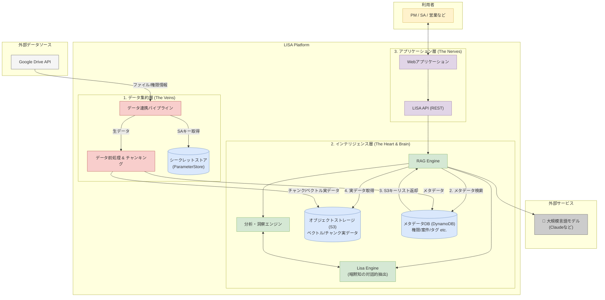

# 1. 基本思想とアーキテクチャ方針

LISAのビジョンである**「組織の集合的知性を拡張し、働くすべての人を『エース』に変える**」を実現するため、MVPアーキテクチャは以下の基本方針を採用する。

| 項目 | 採用方針 | 目的 |
| --- | --- | --- |
| **データ収集方式** | **管理者権限のサービスアカウント** | 組織の知識を網羅的に収集し、「集合知」を構築するため。ユーザーの入力コストを撲滅する。 |
| **ベクトルDB構成** | **単一インデックス ＋ テナントID** | 知識のサイロ化を防ぎ、組織横断でのインサイト抽出を可能にする。将来のマルチテナント化に対応する。 |
| **権限管理方式** | **検索時のメタデータ・フィルタリング** | ユーザーごとにGoogle Driveの権限を完全に遵守し、セキュリティを担保するため。 |

これにより、**「LISAは組織の全知識を学習するが、ユーザーには権限のある情報しか見せない」**という、セキュリティと集合知の拡張を両立した理想的な状態を実現する。

# 2. アーキテクチャ全体像（3ステップ・フロー）

LISAの動作は、以下の3つの明確に分離されたステップで構成される。

### Step 1: 【システム主導】データ収集・ベクトル化

- **役割:** 集合知の構築（バックグラウンドで常時実行）
- **実行者:** **LISAシステム**
- **処理内容:**
    1. テナントごとにLISAが生成した**「サービスアカウント」**を使用する。このアカウント情報はDynamoDBのテナントエンティティで管理される。
        1. 発行したサービスアカウントは2種類のAPIで利用する
            1. generative language API
            2. Google Drive API
        2. APIで共通でサービスアカウント情報を読み出すために共通の認証モジュールを作成してそれぞれの呼び出しで使用する。ただしユーザー作成のサービスアカウントキーがある場合はGoogleDriveAPIにはそちらを使う。
    2. Google Drive内の、サービスアカウントに権限が付与された範囲の全ドキュメントを自動的・網羅的にスキャンする。
    3. 各ドキュメントの**「本文」と「誰がアクセスできるか(権限情報)**」をセットで取得する。
    4. チャンク化・ベクトル化し、実データをS3に、検索・権限用のメタデータをDynamoDBの**単一テーブル**に格納する。

### テナント作成時（共通Admin機能）

trestranの共通Admin機能ではDyanoDBのテーブルにテナントデータの作成処理が必要（一部Ezpipeのテナント作成を参考にする）

- テナント用のサービスアカウントを作成
- サービスアカウントに `generative language API` と`GoogleDrive API` のパーミッションを追加
- DynamoDBにサービスアカウントキーを保存する

### Step 2: 【ユーザー主導】ログイン・認証

- **役割:** 利用者個人の識別
- **実行者:** LISAを利用する社員（PM/SAなど）
- **処理内容:**
    1. ユーザーは自身のGoogleアカウントでLISAにログイン（OAuth認証）し、初回ログイン時にLISAのユーザーとして自動登録される。
    2. LISAはこれにより「今から操作するのはAさんだ」と正確に認識する。
    3. **ポイント：** この認証情報は、あくまで「LISAへのログイン」にのみ使用し、**データ収集には一切使わない。**

### ログイン時の処理

**ログイン時にDynamo上の`userName`と同期する**

1. ユーザーがLISAにログインし、Auth0から認証トークン（JWT）を受け取る。
2. LISAのバックエンド（API）は、そのトークンに含まれるユーザー情報（`name`, `email`など）をデコードする。
3. バックエンドは、トークンから得た`userName`と、DynamoDBに保存されている`userName`を比較する。
4. もし名前が異なっていれば、DynamoDBのレコードを新しい名前で更新する。

### Step 3: 【システム＋ユーザー】検索・ドキュメント生成

- **役割:** 安全な知の活用
- **実行者:** LISAシステム（RAGエンジン）
- **処理内容:**
    1. ログイン中のユーザー（Aさん）が「提案書作成」などを指示する。
    2. LISAは、**「Aさんがアクセスできるドキュメント」**のグループ情報を取得する。
    3. グループ情報をフィルタ条件として必要な実データのみをS3から取得し、Google Driveの権限設定が完全に遵守された、安全な情報のみをコンテキストとする。
    4. その安全な情報を基に、後述のプロンプト階層を適用し、高品質なドラフトを生成する。

## **LISAの概念的なコンポーネントと責務の分離**



# 3. Google Drive APIによる権限判断：セキュリティの心臓部

このアーキテクチャのセキュリティは、Google Drive APIでファイルのアクセス権を正確に取得できることによって担保される。

データ収集パイプライン（`ezpipe`）はファイルスキャン時に、APIを通じて各ファイルの権限リストを取得する。この「誰がアクセスできるか」という情報が、チャンクのメタデータ（`allowedUsers`, `allowedGroups`）としてDynamoDBに格納される。

```json
// "とある提案書.gdoc" の権限情報（API返却イメージ）
{
  "permissions": [
    {
      "type": "user",
      "emailAddress": "owner@your-company.com",
      "role": "owner"
    },
    {
      "type": "user",
      "emailAddress": "editor@your-company.com",
      "role": "writer"
    },
    {
      "type": "group",
      "emailAddress": "sales-team@your-company.com",
      "role": "reader"
    }
  ]
}
```

RAGエンジンは検索時に、このメタデータとログインユーザーのIDや所属グループを照合する。これにより、Google Drive上の権限がLISA内で完全に再現され、ユーザーは自身のアクセス権を超える情報を閲覧することは原理的に不可能である。

# **4. 役割（ロール）と権限モデル**

LISAの運用と価値創造サイクルを円滑に進めるため、以下の3つの役割を定義する。

| **役割** | **主な責務** | **具体的なアクション** |
| --- | --- | --- |
| **システム管理者** | **LISAと組織インフラの初期接続と監視** | ・LISAが自動生成したSAメールアドレスへのGDrive権限付与
・グループの作成
・システムヘルス状態の監視
・**L0: コーポレートDNAプロンプト**の管理 |
| **グループ管理者**
（部長など） | **ビジネスコンテキストの付与と「勝利の型」の定義** | ・「案件」作成とGDriveフォルダの紐付け
・**L1: 思考OSプロンプト**の管理
・**L2: プレイブック・プロンプト**の作成・管理
・Tipsの承認・反映 |
| **ユーザー**
（営業・エンジニアなど） | **知の活用と、現場からの知の蓄積** | ・案件の検索、関連情報の閲覧
・ドキュメントの生成
・**L3: Tipsプロンプト**の投稿 |

# **5. プロンプト管理戦略：階層的モデル**

LISAの「思考の質」を決定づけるプロンプトは、以下の4階層で管理し、組織の知を進化させる。

| **階層** | **プロンプト名称** | **主な内容** | **管理者** | **目的** |
| --- | --- | --- | --- | --- |
| **L0** | **コーポレートDNAプロンプト** | **「我々は何者で、何を成すか」**
会社のミッション、ビジョン、事業内容。CLP | **システム管理者** | LISAに、その会社の一員としての自覚を持たせる。 |
| **L1** | **思考OSプロンプト** | **「我々（部門）はどう考え、どう勝つか」**
部門の思考原則、価値観、判断基準。暗黙知の結晶。 | **グループ管理者** | 部門ごとの「エースの思考」を形式知化し、再現性を高める。 |
| **L2** | **プレイブック・プロンプト** | **「この書類はどう作るか」**
ドキュメント種別ごとの構成、ペルソナ、必須項目。 | **グループ管理者** | 部門のベストプラクティス（勝利の型）を定義する。 |
| **L3** | **Tipsプロンプト** | **「こうすればもっと良くなる」**
現場からの具体的な改善提案。 | **全ユーザー** | 現場の知見をボトムアップで蓄積し、テンプレートを改善し続ける。 |

この階層モデルにより、組織全体の思考の一貫性と、部門・現場の専門性・柔軟性を両立させる。

# **6. 定期実行プロセス (バックグラウンド処理)**

LISAのインテリジェンスを維持・向上させるため、以下の処理を定期的に実行する。

- **ドキュメントの定期的なスキャン:** Google Driveの変更（新規作成、更新、削除、権限変更）を検知し、データベースとインデックスを常に最新の状態に保つ。
- **インサイトの再生成（リフレクションノートの洗い替え）:** 定期的に既存のデータ群を横断的に再分析し、新たなトレンドや知見を抽出した「リフレクション・ノート」を自動更新する。

# **7. 将来的な検討事項 (Post-MVP)**

- **生成ドキュメントのバージョン管理:** 生成されたヒアリングシートや提案書をバージョン管理し、過去の版との比較を可能にすることで、提案内容の変遷や改善の過程の追跡を可能にする。
- **案件内の役割設定:** GDriveの権限とは別に、LISA上で案件の「主担当」「レビュー担当」といった役割を設定し、通知や貢献度評価に活用する。

# 8. データベース設計 (DynamoDB シングルテーブルデザイン)

アプリケーションの主要データベースにはAmazon DynamoDBを採用し、パフォーマンスとスケーラビリティを最大化するため**シングルテーブルデザイン**を基本戦略とする。これにより、複数の関連データを一度のクエリで効率的に取得する。

## 8.1. テーブル構造

- **テーブル名:** `LISA-main-table`
- **キー構造:**
    - **パーティションキー (PK):** `TENANT#<tenant_id>` の形式。テナントごとにデータを完全に分離する。
    - **ソートキー (SK):** `ENTITYTYPE#<entity_id>` の形式。エンティティの種類とIDを格納し、データの関係性を定義する。

## 8.2. 格納エンティティ

単一テーブルには、以下の異なる種類のデータ（エンティティ）を共存させる。

| エンティティ | PK | SK | 主要な属性（データ） |
| --- | --- | --- | --- |
| **テナント** | `TENANT#<tenant_id>` | `METADATA` | `tenantName`, `corporateDnaPrompt`, `createdAt` |
| **ユーザー** | `TENANT#<tenant_id>` | `USER#<user_email>` |  `roles` (`['admin', 'user']`), `createdAt` |
| **グループ** | `TENANT#<tenant_id>` | `GROUP#<group_id>` | `groupName`, `thinkingOsPrompt`, `playbookPrompts` |
| メンバーシップ | `TENANT#...#USER#<user_email>` | `GROUP#<group_id>` | `roleInGroup ('admin', 'member')` |
| **案件** | `TENANT#<tenant_id>` | `PROJECT#<project_id>` | `projectName`, `gdriveFolderId`, `status`, `groupId` |
| 案件タグ | `TENANT#...#PROJECT#<project_id>` | `TAG#<tag_name>` | `createdBy`, `createdAt` |
| ドキュメント | `TENANT#<tenant_id>` | `DOC#<doc_id>#<idx>` | `text`, `vector`, `projectId`, |
| **Tips** | `TENANT#<tenant_id>` | `TIPS#<user_email>#<ts>` | `promptText`, `targetPlaybookId`, `status` (`'proposed'`) |

## 8.3. グローバルセカンダリインデックス (GSI)

### **グループ→ユーザーによる逆引きのためのGSI**

- **GSI名:** `Group-Members-Index`
- **目的:** 特定のグループに所属する全てのユーザーを、一度のクエリで高速に取得する。
- **キー構造:**
    - **GSI パーティションキー:** `TENANT#...#GROUP#<group_id>`
    - **GSI ソートキー:** `USER#<user_email>`

**`メンバーシップ`エンティティをテーブルに保存する際、このGSI用のキーも同時に書き込む。**

### **タグによる逆引き検索のためのGSI**

- **GSI名:** `Tag-Index` （既存のGSIとは別に追加）
- **目的:** 特定のタグが付けられた全ての案件（またはチャンク）を、一度のクエリで高速に取得する。
- **キー構造:**
    - **GSI パーティションキー:** `TENANT#...#TAG#<tag_name>`
    - **GSI ソートキー:** `PROJECT#<project_id>`

## **8.4. 主要属性（データ）の詳細説明**

各エンティティが持つ属性は、LISAの機能を支えるために以下の役割で使用する。

### **テナント (Tenant)**

テナントはLISAを契約する企業や組織単位の最上位エンティティ。

- **`tenantName`:** 契約企業名。UI表示などに使用する。
- **`corporateDnaPrompt`:** **L0プロンプト**。会社のミッションや事業内容など、LISAにその会社の一員としての自覚を持たせるための大元となるプロンプトを格納する。
- **`gcpServiceAccountSecre` :** このテナントのGoogle連携用サービスアカウントキーが格納される（ユーザーが作成したサービスアカウントキー）
- **`DefalutGcpServiceAccountSecre` :** このテナントのGoogle連携用サービスアカウントキーが格納される（テナント作成時に付与されるtrestranのGCPアカウントのサービスアカウントキー）
- **`createdAt`:** データ作成日時。監査や管理目的で使用する。

### **ユーザー (User)**

LISAを利用する個人ユーザー。ユーザー名はAuth0から取得する。

- **`userName`:** ユーザー名。Auth0等から取得し、UI表示用に保持する。ログイン時にAuth0とnameと同期する。
- **`roles`:** ユーザーの役割を定義する配列。`['system_admin', 'group_admin', 'user']` のような値を持ち、LISAアプリケーション内の操作権限を制御する。
- **`createdAt`:** データ作成日時。

### **グループ (Group)**

部門やチームといった、ユーザーが所属する単位。プロンプト管理の中心的な役割で使用する。

- **`groupName`:** 部署名やチーム名（例：データ事業本部）。
- **`thinkingOsPrompt`:** **L1プロンプト**。部門の思考原則や価値観など、そのグループのエースの思考を形式知化したプロンプトを格納する。
- **`playbookPrompts`:** **L2プロンプト群**。ヒアリングシート用、提案書用など、ドキュメント種別ごとに定義されたプレイブック（テンプレート）プロンプトを格納する。Map型（オブジェクト）で管理する。（例：`{'hearing_sheet': '...', 'proposal': '...'}`）。

### **メンバーシップ (Membership)**

「どのユーザーがどのグループに所属しているか」という多対多の関係性を表現するエンティティ。GDriveのアクセス権限から自動的に作成する。

- **`roleInGroup`:** グループ内でのユーザーの役割（例：`'admin'`, `'member'`）。グループ管理者を判定するために使用する。`admin,member`はユーザーロール`'group_admin', 'user'` から判断する。

### **案件 (Project)**

ユーザーが取り組む具体的なプロジェクトや案件。ナレッジのコンテキストを定義する

- **`projectName`:** 案件名。
- **`gdriveFolderId`:** この案件に関連するドキュメントが格納されているGoogle DriveのフォルダIDです。データ収集の起点となる。
- **`status`:** 案件のステータス（例：`'active'`, `'closed'`, `'archived'`）。`archived`なら案件情報の更新は行わない。
- **`groupId`:** この案件を管轄するグループのID。どのグループのプロンプト（思考OSやプレイブック）を適用するかの判断に使う。
- **`reflectionNoteS3ObjectKey`:** この案件を管轄するグループのID。どのグループのプロンプト（思考OSやプレイブック）を適用するかの判断に使う。

### **ドキュメント (Document)**

S3 Vectorsに登録されている情報を削除・更新するための情報。RAGとしてこのデータは使わない。

- **`s3ObjectKey`:** **（最重要）** チャンクの本文（`text`）とベクトルデータ（`vector`）が格納されているS3オブジェクトのキー（ファイルパス）。これが実データへのポインタとなる。
- **`projectId`:** このチャンクがどの案件に属するかを示す案件ID。
- **`sourceDocumentId`:** （推奨）このチャンクの元となったGoogle Drive上のドキュメントID。データ洗替のトレーサビリティ用。
- **`groupIds`:** このドキュメントにアクセスできるグループID。データ洗替のトレーサビリティ用。
- **`createdAt`:** このメタデータが作成された日時。データ洗替のトレーサビリティ用。
- **`updatedAt`:** このメタデータが最後に更新された日時。データ洗替のトレーサビリティ用。

### **Tips (Tips)**

現場ユーザーから投稿される、プロンプトの改善提案。

- **`promptText`:** ユーザーが投稿した具体的なプロンプトの改善案や追加項目のテキスト。
- **`targetPlaybookId`:** このTipsがどのプレイブック（L2プロンプト）に対する改善提案かを示すID。
