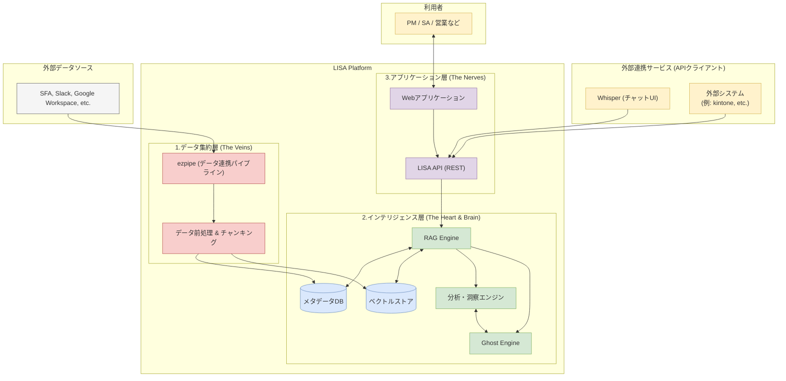
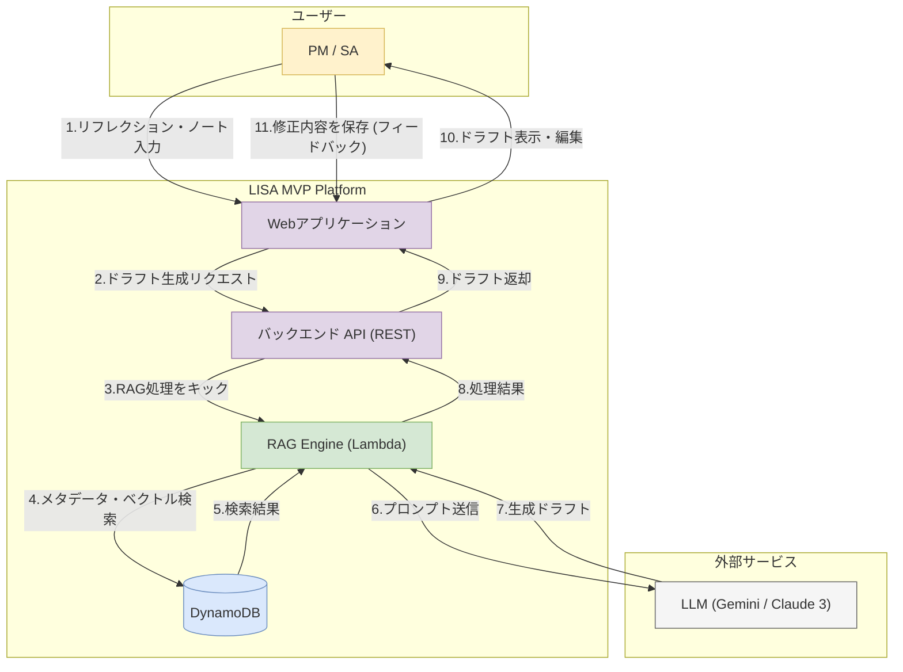

# LISAのアーキテクチャ



## **ドキュメント1：LISA 最終形アーキテクチャ**

## **LISA システムアーキテクチャ概要**

本ドキュメントは、ナレッジ活用プラットフォーム「LISA」の最終的なシステムアーキテクチャを定義する。本アーキテクチャは、スケーラビリティ（拡張性）、セキュリティ、および保守性を確保するため、責務の分離を明確にした3層構造を採用する。

### **1. データ集約層 (Data Ingestion Layer)**

**役割:**
組織内外に散在する多様なデータソースから情報を継続的かつ安全に収集し、後続の処理層へ供給するパイプライン。システム全体の「情報収集基盤」としての役割を担う。

**主要コンポーネント:**

- **データ連携パイプライン (`ezpipe`)**
    - **責務:** 各種SaaS（Salesforce,HubSpot, Slack, Google Workspace等）やファイルストレージとAPI連携し、新規・更新データをリアルタイムまたは定期バッチ処理で取得する。
        - Backlog,Confluenceなどチケット管理ツールをデータソースとして使うこともある
    - **セキュリティ:** 認証情報（APIキー、OAuthトークン）は、AWS Secrets ManagerやHashiCorp Vault等のシークレット管理サービスを用いて暗号化・集中管理し、コードからの分離を徹底する。
    - **堅牢性:** APIの流量制御（レートリミット）への対応や、一時的なネットワーク障害発生時の指数バックオフ付きリトライ処理を実装し、安定したデータ取得を保証する。
- **データ前処理・チャンキングモジュール**
    - **責務:** 取得した多様な形式のデータ（JSON, HTML, PDF, Markdown等）からテキスト情報を抽出し、意味的なまとまりを持つ単位（チャンク）に分割する。この処理は、後続のAIモデルが情報を効率的に処理するための基盤となる。
    - **保守性:** データソース毎にパーサー（解釈・変換処理）をモジュール化することで、新規データソースへの対応を容易にする。

### **2. インテリジェンス層 (Intelligence Layer)**

**役割:**
収集した生データを知的資産、すなわち「インサイト」へと変換するシステムの中核。LISAのコアバリューを生み出す心臓部であり、脳に相当する。

**主要コンポーネント:**

- **ベクトルストア (Vector Store)**
    - **責務:** テキストチャンクを埋め込みモデル（Embedding Model）※1 を用いて数値ベクトルに変換し、高速な類似度検索を可能にする専用データベースに格納する。
    - **技術選定:** パフォーマンスと運用負荷を考慮し、Amazon OpenSearch Serviceや、PostgreSQLの拡張機能である`pg_vector`、またはPineconeのようなマネージドサービスを候補とする。
- **メタデータDB (Metadata Database)**
    - **責務:** 各チャンクに紐づく属性情報（出典元ドキュメント、作成者、作成日時、関連プロジェクトID等）を格納する。ベクトル検索の結果に正確なコンテキストを付与し、検索結果の信頼性を担保するために不可欠である。
- **RAGエンジン (Retrieval-Augmented Generation Engine)**
    - **責務:** ユーザーからのリクエスト（質問）に基づき、ベクトルストアから関連性の高い情報を検索（Retrieval）し、その情報を基に大規模言語モデル（LLM）※2 が正確な回答やドキュメントを生成（Generation）するプロセス全体を制御する。
- **ペルソナエンジン (Persona Engine)**
    - **責務:** 複数の専門家（例: エースPM、トップ営業）の思考パターンを模倣するプロンプトテンプレートと推論ロジックを管理・実行する。RAGエンジンからの要求に応じ、特定の役割に基づいた多角的な分析やレビューを提供する。
- **分析・洞察エンジン (Analysis & Insight Engine)**
    - **責務:** 複数のドキュメントや会話ログを横断的に分析し、「リフレクション・ノート」のような高付加価値な要約を自動生成する。内部では、トピックモデリングやナレッジグラフ構築といった高度な分析処理を実行する。

> ※1 埋め込みモデル (Embedding Model): テキストの持つ意味を、コンピュータが扱える数値の配列（ベクトル）に変換するAIモデルである。
※2 大規模言語モデル (LLM): 大量のテキストデータで学習し、人間のように自然な文章を生成・理解できるAIモデルである。GPT-4やClaude 3などが代表例である。
> 

### **3. アプリケーション層 (Application Layer)**

**役割:**
インテリジェンス層で生成されたインサイトを、エンドユーザーや外部システムが利用するためのインターフェースを提供する。システムの「顔」となる部分である。

**主要コンポーネント:**

- **LISA API (RESTful API)**
    - **責務:** システムの全機能へのアクセスを提供する統一されたAPIエンドポイント。クライアント（Webアプリケーション、外部システム等）からのリクエストを受け付け、インテリジェンス層へ処理を委譲する。
    - **拡張性とセキュリティ:** 標準的なRESTful形式で提供し、外部システム（例: kintone, Slack Bot）との連携を容易にする。API Gatewayを利用して認証・認可（アクセス制御）を実装し、不正なアクセスからシステムを保護する。
- **Webアプリケーション (Client Application)**
    - **責務:** 高度な検索、ドキュメント生成、ナレッジの可視化など、LISAの全機能を利用するためのリッチなUI/UXを提供する。
    - **技術選定:** Next.jsやReactといったモダンなフロントエンドフレームワークを採用し、高い応答性と保守性を両立した開発を目指す。

---

## **ドキュメント2：PoC/MVPフェーズにおけるデータストア戦略**

### **LISA MVP版アーキテクチャ**

**MVPの目的:**
「ユーザー（PM/SA）が、LISAの支援を受けながら**リフレクション・ノートを入力**し、その結果として生成される**ドキュメントドラフトに価値を感じ、継続的に利用してくれるか**」という、最も重要なコア仮説を検証する。



## **PoC/MVPフェーズにおけるデータストア戦略とロードマップ**

### **1. 基本方針**

プロジェクトの初期段階（PoC:概念実証、MVP:実用最小限の製品）においては、プロダクトのコア価値を低コストかつ迅速に検証することを最優先とする。そのため、インフラストラクチャは、サーバーの管理が不要で、利用量に応じた課金体系を持つサーバーレスアーキテクチャを基本方針とする。

### **2. 最小構成案：DynamoDB単独アーキテクチャ**

メタデータとベクトルデータの両方を**Amazon DynamoDB** ※3 のみで管理する構成を初期案とする。

**2.1. 構成要素と役割**

- **メタデータストアとしての利用:**
    - チャンクIDをパーティションキーとし、出典元、プロジェクトID等のメタデータを属性として格納する。これはDynamoDBの主要なユースケースに合致する。
- **ベクトルストアとしての利用（擬似的実装）:**
    - DynamoDBはベクトル検索専用DBではないため、類似度検索ロジックをアプリケーション側（AWS Lambda ※4）で実装する。
    - **検索プロセス:**
        1. （オプション）GSI（グローバルセカンダリインデックス）を用いて、メタデータ（例: `projectId`）で検索対象のチャンクを大まかに絞り込む。
        2. 絞り込んだチャンクのベクトルデータをDynamoDBから取得し、Lambda関数のメモリ上にロードする。
        3. Lambda関数内で、ユーザーの質問ベクトルと対象チャンクの全ベクトルとの類似度（例: コサイン類似度）を総当たりで計算する。
        4. 類似度スコア上位のチャンクを特定し、そのテキスト情報をLLMへのプロンプトに含めて回答を生成する。

```python
# Lambda関数内での類似度計算の擬似コード例
import numpy as np

def find_similar_chunks(query_vector, target_chunks):
    """
    メモリ上でコサイン類似度を計算し、類似チャンクを返す

    Args:
        query_vector (np.array): ユーザーの質問をベクトル化したもの
        target_chunks (list): 検索対象のチャンクのリスト。各要素は辞書で、'id'と'vector'キーを持つ。

    Returns:
        list: 類似度スコアでソートされたチャンクのリスト
    """
    # 全てのベクトルをNumPy配列に変換
    target_vectors = np.array([chunk['vector'] for chunk in target_chunks])

    # コサイン類似度を計算 (クエリベクトルと各ターゲットベクトルの内積)
    # ベクトルは事前に正規化されていることを想定
    scores = np.dot(target_vectors, query_vector)

    # スコアとチャンクIDを紐付けてソート
    results = []
    for i, score in enumerate(scores):
        results.append({
            'id': target_chunks[i]['id'],
            'score': score
        })

    # スコアの高い順にソート
    sorted_results = sorted(results, key=lambda x: x['score'], reverse=True)

    return sorted_results[:10] # 上位10件を返す

```

> ※3 Amazon DynamoDB: AWSが提供するフルマネージドのNoSQLデータベースである。
※4 AWS Lambda: サーバーを意識することなくコードを実行できる、イベント駆動型のコンピューティングサービスである。
> 

### **3. DynamoDB単独構成の評価**

**3.1. メリット**

- **圧倒的な低コスト:** DynamoDBおよびLambdaは完全従量課金制のため、データ量やリクエスト数が少ない初期フェーズでは、インフラコストを極めて低く抑えることが可能である。
- **迅速な開発と運用負荷の軽減:** サーバーのプロビジョニングやOS管理が不要なため、開発リソースをプロダクトのコアロジック開発に集中できる。

**3.2. デメリットおよび許容すべきトレードオフ**

- **検索パフォーマンスの限界（最大の技術的負債）:**
    - ベクトル検索はアプリケーションメモリ上での総当たり計算となるため、データ件数の増加に比例して検索応答時間が悪化する。これは、将来解消すべき**技術的負債**であることを明確に認識する必要がある。Lambdaの実行時間制限（最大15分）が、一度に処理できるデータ量の上限となる。
- **実装の複雑化:**
    - 類似度計算ロジックや、それに付随するデータハンドリングを自前で実装する必要があり、専用のベクトルDBを利用する場合に比べて開発工数が増加する。
- **高度な検索機能の制限:**
    - キーワード検索とベクトル検索を組み合わせた「ハイブリッド検索」など、検索精度を向上させる高度な機能の実装は極めて困難である。

### **4. 推奨ロードマップ**

上記評価に基づき、事業フェーズに合わせた段階的な開発ロードマップを推奨する。

1. **PoC / MVP初期フェーズ (対象データ: 〜数万チャンク)**
    - **採用アーキテクチャ:** **DynamoDB単独構成**
    - **目的:** コストを最小化し、LISAのコア価値（リフレクション・ノート生成等）の検証を最優先する。検索パフォーマンスの課題は、この段階における許容可能な制約とする。
    - **監視項目:** 検索APIの平均応答時間（レイテンシ）を常に監視する。
2. **MVP中期 / スケールフェーズ (対象データ: 数十万チャンク〜)**
    - **移行トリガー:** 検索レイテンシがビジネス上の許容値（例: **500ms**）を恒常的に超えるようになった時点。
    - **移行戦略:** ベクトル検索の責務を、専用のマネージドサービスに分離する。メタデータは引き続きDynamoDBまたはリレーショナルDBで管理する。

**移行先アーキテクチャ候補の比較**

| 移行先候補 | メリット | デメリット |
| --- | --- | --- |
| **Amazon OpenSearch Service** | AWSエコシステムとの親和性が高い。ハイブリッド検索を標準でサポート。 | `pgvector`等に比べ、運用設定がやや複雑になる可能性がある。 |
| **Aurora (PostgreSQL) + `pgvector`** | メタデータとベクトルデータを同一DBで管理でき、構成がシンプル。SQLによる柔軟なクエリが可能。 | ベクトル検索特化DBに比べ、超大規模データセットでの性能が劣る場合がある。 |

**結論:**
スモールスタート戦略として、初期は**DynamoDB単独構成**を採用し、最速での価値検証を目指す。同時に、パフォーマンス指標を定常的に監視し、ビジネスの成長に合わせて適切なタイミングで専用ベクトルDBへの移行計画を実行する。このアプローチにより、初期の不確実性が高い段階での過剰な投資を避けつつ、将来のスケールに備えることが可能となる。