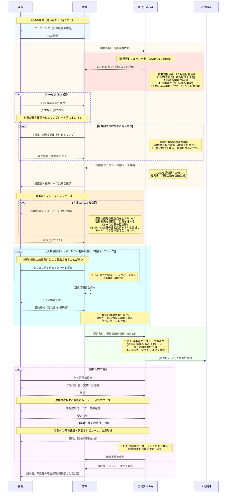

# 業務フロー

# (整理前)BS部の業務フローと各ステップでの成果物

## 業務フロー



- 修正前
    
    ```mermaid
    sequenceDiagram
        participant 顧客 as 顧客
        participant 営業 as 営業
        participant 開発 as 開発
        participant 人材調達 as 人材調達
    
        %% --- プレ提案フェーズ ---
        rect rgb(240, 248, 255)
            note over 顧客, 営業: 案件の発生（問い合わせ, セミナー, 紹介など）
            営業->>顧客: 一次ヒアリング（案件概要の確認）
            営業->>顧客: NDA締結
        end
    
        %% --- 提案フェーズ ---
        rect rgb(255, 250, 240)
            顧客->>営業: RFP / 詳細な要件提示
            営業->>開発: 案件相談・技術支援依頼
            
            Note right of 開発: 営業と開発で討議資料等を準備
            営業->>顧客: 【営業・開発同席】要件ヒアリング
            顧客-->>営業: 要件詳細・課題感を共有
    
            開発->>営業: 提案書ドラフト・提案ベース見積
            営業->>顧客: 提案書・提案ベース見積を提示
    
            Note over 営業, 開発: (必要に応じて)<br/> セキュリティチェックシート等を作成・提出
            
            顧客-->>営業: 内示 (Goサイン)
            
            営業->>営業: 正式見積書を作成
            営業->>顧客: 正式見積書を提出
            顧客-->>営業: 契約締結（注文書受領 or 契約書）
        end
    
        %% --- プロジェクト準備フェーズ ---
        rect rgb(240, 255, 240)
            営業->>開発: 契約条件・要件詳細を伝達 (Kick Off)
            
            Note over 開発, 人材調達: 開発部門内でアサイン調整<br/>(BP利用時などは人材調達と連携)
            開発->>人材調達: (必要に応じて)人材要件提示
        end
    
        %% --- 開発・納品フェーズ ---
        rect rgb(255, 245, 255)
            開発->>顧客: 基本設計書提出
            開発->>顧客: 詳細設計書・実装計画提出
            顧客-->>開発: 承認
    
            開発->>顧客: 開発成果物、テスト結果報告
            顧客-->>開発: 受入検収
            
            開発->>営業: 検収完了報告
            営業->>顧客: 請求書, 稼働実績表, 完了報告書などを発行
        end
    
    ```
    
    ```mermaid
    sequenceDiagram
        participant 顧客 as 顧客
        participant 営業 as 営業
        participant 開発 as 開発(PM/SA)
        participant 人材調達 as 人材調達
    
        %% --- プレ提案フェーズ ---
        rect rgb(240, 248, 255)
            note over 顧客, 営業: 案件の発生（問い合わせ, 紹介など）
            営業->>顧客: 一次ヒアリング（案件概要の確認）
            営業->>顧客: NDA締結
        end
    
        %% --- 提案フェーズ ---
        rect rgb(255, 250, 240)
            営業->>開発: 案件相談・技術支援依頼
            
            rect rgb(255, 228, 225)
                note over 開発: 【最重要】ノルソル判断（Go/NoGo Decision）
                開発-->>営業: 以下の観点で初期リスクを評価
                note right of 開発: 1. 体制規模 (例: 12人月超は要注意)<br>2. 契約形態 (例: 請負はリスク高)<br>3. 技術的実現性/実績<br>4. 運用要件 (例: 24/365はNG)<br>🤖LISA: 過去案件DBからリスクを自動判定
            end
    
            alt RFPあり (約2-3割)
                顧客->>営業: RFP / 詳細な要件提示
            else RFPなし (約7-8割)
                note over 顧客, 営業: 営業が顧客要望をヒアリングシート等にまとめる
            end
            
            loop 複数回やり取りする場合あり
                営業->>顧客: 【営業・開発同席】要件ヒアリング
                note right of 開発: 顧客の要望が曖昧な場合、<br>構成図を描きながら認識を合わせる<br>「一緒にRFPを作る」状態になることも。
                顧客-->>営業: 要件詳細・課題感を共有
            end
    
            開発->>営業: 提案書ドラフト・提案ベース見積
            note right of 開発: 🤖LISA: 類似案件(ヤーマン等)から<br>提案書・見積工数を自動生成
    
            営業->>顧客: 提案書・提案ベース見積を提示
            
            opt 大規模案件・セキュリティ要件が厳しい場合
                営業->>顧客: セキュリティチェックシート提出
                note right of 営業: 🤖LISA: 過去の回答ナレッジベースから<br>回答案を自動生成
            end
            
            顧客-->>営業: 内示 (Goサイン)
            
            営業->>営業: 正式見積書を作成
            営業->>顧客: 正式見積書を提出
            顧客-->>営業: 契約締結（注文書 or 契約書）
            note over 営業, 開発: ※契約形態は準委任が主。<br>請負や「成果物なし請負」等の<br>例外パターンも存在。
        end
    
        %% --- プロジェクト準備フェーズ ---
        rect rgb(240, 255, 240)
            営業->>開発: 契約条件・要件詳細を伝達 (Kick Off)
            note over 開発: 🤖LISA: 議事録からステークホルダー<br>(承認者/実務担当者)を抽出し、<br>H2O案件のような齟齬リスクを警告
            
            開発->>人材調達: (必要に応じて)人材要件提示
        end
    
        %% --- 開発・納品フェーズ ---
        rect rgb(255, 245, 255)
            alt 請負契約の場合
                開発->>顧客: 基本設計書提出
                開発->>顧客: 詳細設計書・実装計画提出
                顧客-->>開発: 承認
                note over 開発, 顧客: 成果物に対する厳密なレビューと承認プロセス
                開発->>顧客: 開発成果物、テスト結果報告
                顧客-->>開発: 受入検収
            else 準委任契約の場合 (主流)
                note over 開発, 顧客: 定例MTG等で設計・実装をレビューし、合意形成
                開発-->>顧客: 随時、開発成果物を共有
                note over 開発: 🤖LISA: 仕様変更・サイレント更新を検知し<br>影響範囲を自動で特定・通知
                開発->>営業: 稼働実績を報告
            end
            
            開発->>営業: 検収完了 or フェーズ完了報告
            営業->>顧客: 請求書, (準委任の場合)稼働実績表などを発行
        end
    
    ```
    

## **フローでの主要な成果物**

- **営業**
    - **NDA（秘密保持契約書）**
        - **フロー上の位置:** 【プレ提案フェーズ】一次ヒアリング後、RFPや詳細な要件を顧客から受領する前。
        - **説明:** 顧客の機密情報を取り扱うために、本格的な提案活動に先立って締結する契約書。
    - **ヒアリングシート / 討議資料**
        - **フロー上の位置:** 【提案フェーズ】要件ヒアリング前〜ヒアリング中。
        - **説明:** 顧客との議論のたたき台となる資料。**RFPがない案件（7-8割）では、営業が顧客要望をまとめたこのヒアリングシートが提案の起点となるため、極めて重要。**
    - **議事録**
        - **フロー上の位置:** 【全フェーズ】ミーティングが発生する都度。
        - **説明:** 決定事項、ToDo、課題などを記録。**特に、ドメイン知識に関するQ&Aや、顧客の曖昧な要望を具体化していく過程（「一緒にRFPを作る」プロセス）が記録されており、LISAにとって暗黙知抽出の宝庫となる。**また営業はHubSpotへの登録が必須となっている。
    - **非公式コミュニケーションログ (Slack, 電話メモ)**
        - **フロー上の位置:** 【クロージングフェーズ】提案後〜内示まで
        - **説明:** **エース営業の暗黙知が最も凝縮される成果物。** 公式の場では聞けない顧客の「本音」や「懸念」、競合の状況、キーマンの感触などが記録される。**Slackが主戦場**となる。LISAの**`Analyze Engine`**が最優先で分析すべき情報源。
    - **提案書**
        - **フロー上の位置:** 【提案フェーズ】要件ヒアリング後、顧客への提案時。
        - **説明:** 顧客の課題に対し、弊社のソリューション、体制、スケジュール、概算費用などをまとめて提示する中心的なドキュメント。「キラリポイント」を盛り込むことが受注の鍵となる。
    - **提案ベース見積書**
        - **フロー上の位置:** 【提案フェーズ】提案書と同時に提示。
        - **説明:** 提案内容に基づいた概算の費用を示す見積書。この段階ではまだ正式な発注用ではない。
    - **セキュリティチェックシート**
        - **フロー上の位置:** 【契約締結フェーズ】**内示後、契約締結の前提条件として要求されることが多い。**
        - **説明:** **提出は「レアケース」。** 顧客（特に大企業）から提示される、弊社のセキュリティ体制に関する質問票。回答には専門知識が必要で、負担の大きい書類。
    - **正式見積書**
        - **フロー上の位置:** 【提案フェーズ】顧客からの内示（Goサイン）が出た後。
        - **説明:** 顧客が発注手続きを行うための正式な見積書。Salesforce等で作成される。
    - **契約書**
        - **フロー上の位置:** 【提案フェーズ】正式見積書提出後、プロジェクト開始前。
        - **説明:** 業務委託契約書など。**準委任契約が主だが、請負契約や「成果物なし請負」といったバリエーションが存在し、この内容によって以降の成果物の定義や検収条件が大きく変わる。**
    - **稼働実績表**
        - **フロー上の位置:** 【開発・納品フェーズ】**主に準委任契約の場合**、毎月の請求時。
        - **説明:** プロジェクトメンバーがその月にどれだけ稼働したかを記録し、請求の根拠として顧客に提出する書類。
    - **完了報告書**
        - **フロー上の位置:** 【開発・納品フェーズ】**主に請負契約の場合**、検収前。
        - **説明:** 契約内容に基づき、開発が完了したことを報告するための書類。
    - **請求書**
        - **フロー上の位置:** 【開発・納品フェーズ】検収完了後、または毎月の締め日。
        - **説明:** 提供した役務に対する対価を顧客に請求するための書類。
- **開発**
    - **技術調査資料**
        - **フロー上の位置:** 【提案フェーズ】要件ヒアリング後、提案書作成時。
        - **説明:** 顧客要件の実現可能性や、最適な技術選定の根拠を示すために作成する内部・外部向け資料。
    - **基本設計書/詳細設計書**
        - **フロー上の位置:** 【開発・納品フェーズ】プロジェクト開始後、初期段階。
        - **説明:** **請負契約では顧客承認を得るための厳密なドキュメントとして作成されるが、準委任契約では定例MTGでの合意形成の補助資料として、より柔軟な形式（例: Confluence, Backlog）で作成されることが多い。ドコモ案件のように「成果物なし」の場合は、公式な提出物とならないケースもある。**
    - **テーブル定義書 / データ加工仕様書**
        - **フロー上の位置:** 【開発・納品フェーズ】詳細設計時。
        - **説明:** **ヤーマン案件のように、顧客から提示された曖昧な変換イメージを、PM/SAがヒアリングを通じて具体的なテーブル定義や加工ロジックに落とし込んだもの。暗黙知を形式知に変換する典型的な成果物。**
    - **実装計画書（WBS）**
        - **フロー上の位置:** 【開発・納品フェーズ】詳細設計と並行、またはその直後。
        - **説明:** 誰が、いつまでに、どの機能を実装するのかを具体的に定めたスケジュールおよびタスクリスト。
    - **開発成果物一式**
        - **フロー上の位置:** 【開発・納品フェーズ】実装完了後、顧客への納品時。
        - **説明:** ソースコード、実行ファイル、設定ファイルなど、開発によって作成された全てのプロダクト。
    - **テスト結果報告書**
        - **フロー上の位置:** 【開発・納品フェーズ】開発成果物の納品と同時、またはその直前。
        - **説明:** **請負契約では検収の必須要件となるが、準委任契約では省略されたり、より簡素な形式になったりする場合がある。**
- **人材調達**
    - スキル要件整理、人材候補リスト、採用結果・配属計画
- **顧客**
    - **RFP（提案依頼書）・要件定義書**
        - **フロー上の位置:** 【提案フェーズ】案件相談の起点。
        - **説明:** **提示されるのは全体の2-3割程度。RFPがある案件は大規模コンペになる傾向がある。**
    - **注文書**
        - **フロー上の位置:** 【提案フェーズ】正式見積書を受領後、契約の証として発行。
        - **説明:** 弊社の提案と見積もり内容に合意し、正式に業務を依頼することを示す書類。契約書に代わる場合もある。
    - **（各種設計書等に対する）承認書**
        - **フロー上の位置:** 【開発・納品フェーズ】基本設計書や詳細設計書などの提出後。
        - **説明:** **主に請負契約において発行される。準委任契約では、議事録での合意をもって承認とみなすケースが多い。**
    - **検収書**
        - **フロー上の位置:** 【開発・納品フェーズ】開発成果物の受入検収後。
        - **説明:** 納品された成果物が要求仕様を満たしていることを確認し、受領したことを証明する書類。請求プロセスのトリガーとなる。
